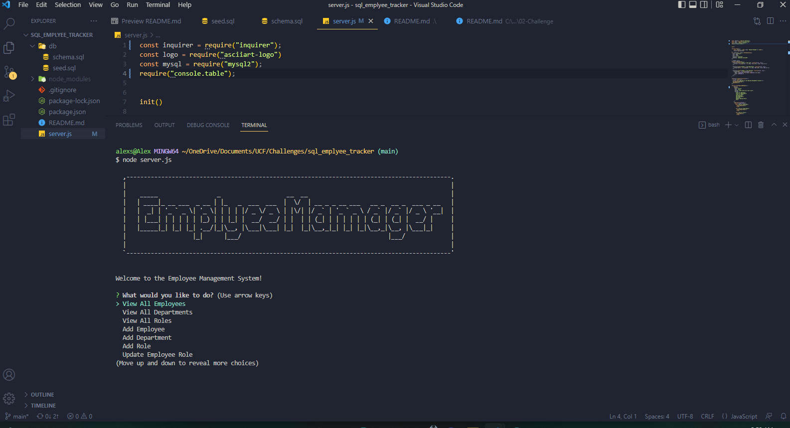
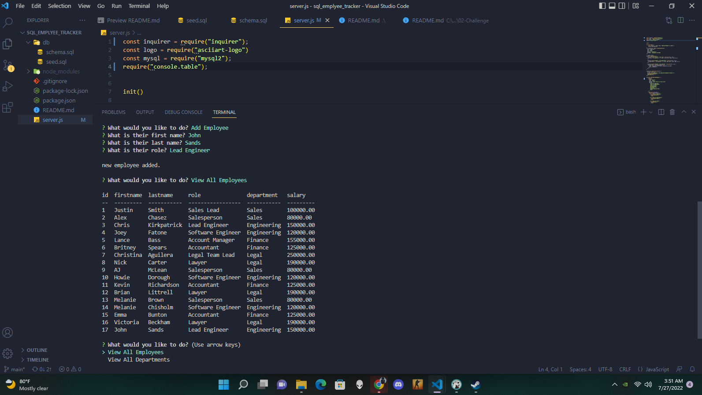

# SQL Emplyee Tracker


 ## Table-of-Contents

  * [User Story](#user-story)
  * [Description](#description)
  * [Walkthrough Video](#walkthrough-video)
  * [ScreenShot](#screenshots)

  
 # User-Story
```
AS A business owner
I WANT to be able to view and manage the departments, roles, and employees in my company
SO THAT I can organize and plan my business
```
# Description
Assignment is to build a solution for managing a company's employee database using Node, Inquirer and MySQL to be able to view, add and update employees, departments and roles.


# Walkthrough-Video

[Walkthrough Video Link]()


# ScreenShots 





